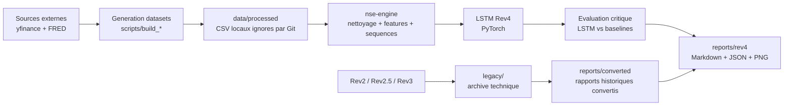
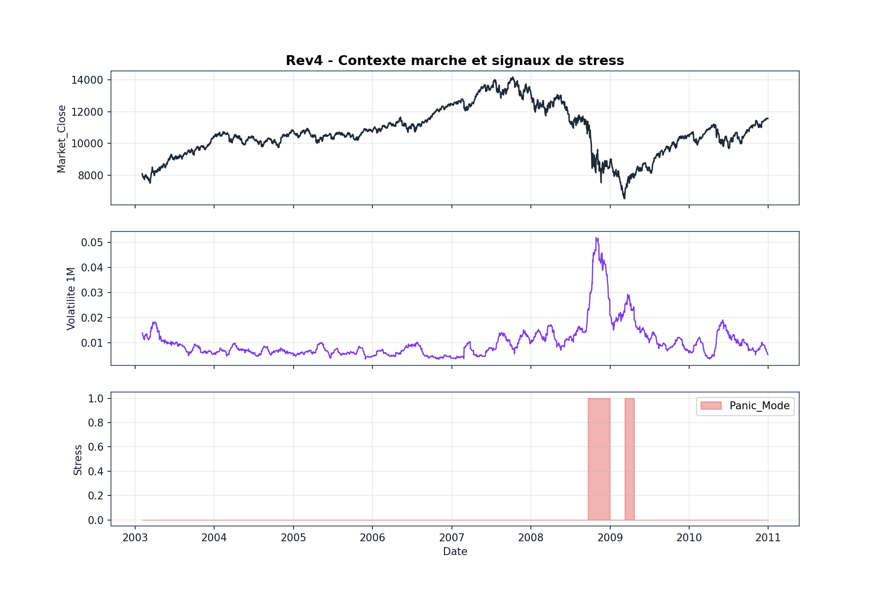
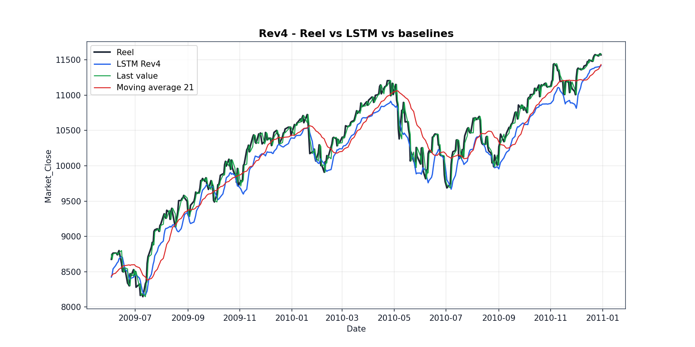
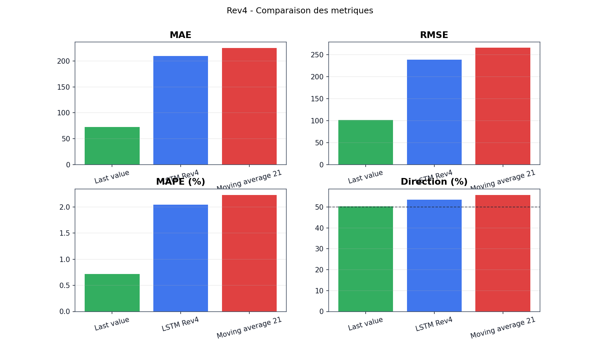
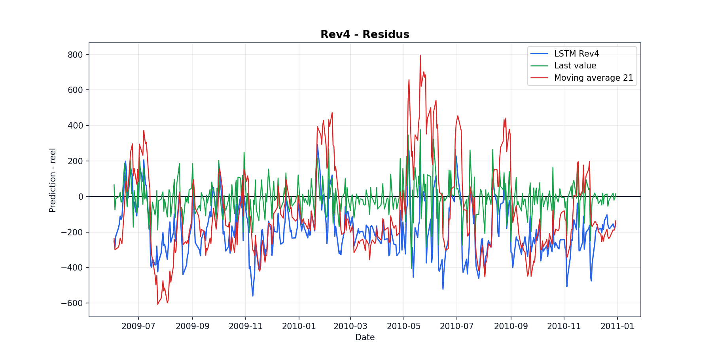
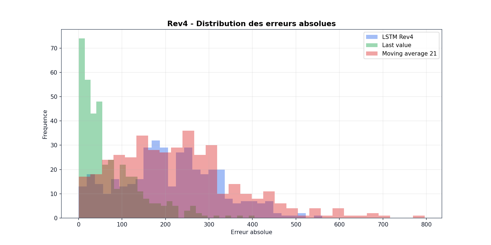
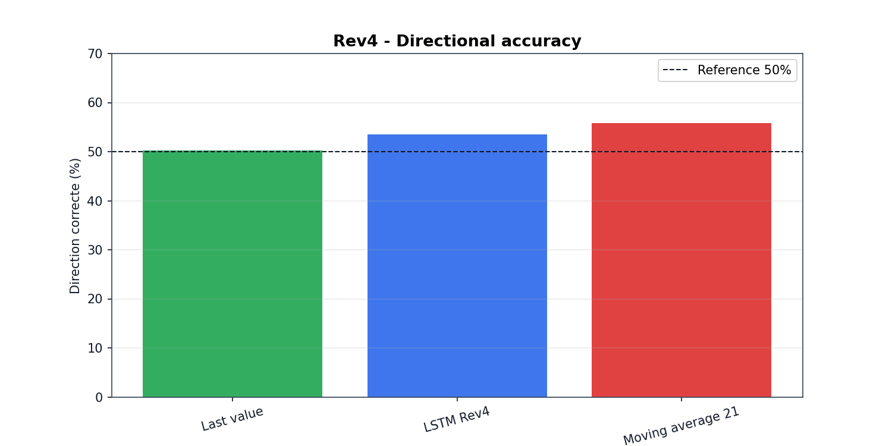

# Neural Stock Exchange - Experimental LSTM Market Lab


## Presentation

Neural Stock Exchange est un laboratoire experimental autour des series temporelles financieres.

Le projet explore la combinaison de donnees de marche, de variables macroeconomiques, de features de volatilite et de modeles LSTM PyTorch pour analyser des signaux de stress sur la periode 2003-2010.

Ce depot ne presente pas un produit financier, un bot de trading ou une promesse de prediction fiable. Il documente la remise en etat d'un ancien prototype personnel, construit dans une logique d'apprentissage avance, vers un laboratoire local plus propre, testable et reproductible.

Le projet doit se lire comme un projet experimental etudiant pousse : beaucoup d'iterations, des traces legacy conservees, un moteur Rev4 reconstruit proprement, et surtout une evaluation critique qui accepte de montrer quand le LSTM ne bat pas une baseline naive.

## Pourquoi ce projet existe

Neural Stock Exchange est parti d'une intuition simple : utiliser des donnees de marche, des signaux macroeconomiques et un LSTM pour explorer si certains regimes de stress financier pouvaient etre detectes dans les annees precedant la crise de 2008.

La version actuelle ne cherche pas a prouver qu'un modele predit les crises. Elle montre plutot un chemin d'ingenierie et d'apprentissage :

- recuperer un prototype fragmente ;
- separer le legacy du flux actif ;
- reconstruire des donnees propres ;
- entrainer un LSTM reproductible ;
- comparer le modele a des baselines simples ;
- documenter franchement les limites.

L'interet principal du projet est donc la demarche : experimentation, rigueur progressive, evaluation critique et transparence.

## Avertissement

Ce projet est strictement experimental.

Les resultats, rapports, predictions et signaux `Panic_Mode` ne constituent pas un conseil financier. Ils ne doivent pas etre utilises pour prendre des decisions d'investissement, de trading ou de gestion de risque reel.

## Objectif

Le projet vise a montrer :

- la collecte de donnees marche et macro ;
- le nettoyage strict de series temporelles ;
- la creation de features de volatilite ;
- la preparation de sequences LSTM ;
- l'entrainement d'un baseline Rev4 reproductible ;
- la conservation documentee de modeles legacy ;
- la conversion de rapports historiques en Markdown, CSV et JSON ;
- l'evaluation critique d'un LSTM face a des baselines simples.

## Architecture

Vue logique du projet :



Lecture rapide :

- `src/nse_engine/` contient le moteur actif et testable.
- `legacy/` conserve l'histoire technique du projet, sans etre le flux principal.
- `data/processed/` contient les datasets reconstruits localement et ignores par Git.
- `models/rev4/` contient le modele Rev4, son scaler et sa metadata.
- `reports/rev4/` contient les sorties lisibles de l'experimentation.

Structure du depot :

```text
.
|-- data/                 # Donnees locales regenerables, non versionnees par defaut
|-- docs/                 # Documentation publique du projet
|-- legacy/               # Scripts historiques conserves comme archive technique
|-- models/
|   |-- legacy/           # Poids historiques Rev2 / Gold legacy
|   `-- rev4/             # Modele Rev4, scaler et metadata
|-- reports/
|   |-- legacy/           # Rapports historiques Excel
|   |-- converted/        # Exports legacy propres
|   `-- rev4/             # Rapport du modele Rev4
|-- scripts/              # Commandes locales
|-- src/nse_engine/       # Moteur Python propre
|-- tests/                # Tests offline
|-- requirements.txt
|-- requirements-legacy.txt
|-- requirements-dev.txt
`-- README.md
```

## Revisions

Le projet distingue clairement plusieurs etapes.

| Revision | Statut | Role |
|---|---|---|
| Rev2 | Legacy | Prototype Dow/Macro historique, modele conserve mais donnees/scaler incomplets |
| Rev2.5 | Legacy | Ajout historique du signal `Panic_Mode` dans les rapports |
| Rev3 | Legacy-advanced | Prototype avance, utile comme inspiration, non utilise comme pipeline actif |
| Rev4 | Reproductible | Flux reconstruit avec dataset propre, LSTM, scaler, metadata et rapport |

Cette histoire fait partie du projet. Rev2, Rev2.5 et Rev3 ne sont pas caches : ils expliquent l'evolution d'un prototype etudiant experimental vers une base plus saine.

## nse-engine et nse-engine-gold

`nse-engine` est le moteur Python propre du projet. Il contient le nettoyage, les features, la preparation de sequences, les modeles LSTM, le reporting et les conversions legacy.

`nse-engine-gold` designe la variante historique Gold. Elle sert de preuve de recuperation technique du vieux LSTM Gold, avec une prediction primitive documentee. Ce flux reste legacy et ne doit pas etre presente comme un modele financier fiable.

## Donnees

Les donnees completes ne sont pas versionnees par defaut.

Sources utilisees ou preparees :

- Gold : yfinance, ticker `GC=F` ;
- Dow Jones : yfinance, ticker `^DJI` ;
- NASDAQ : FRED public, serie `NASDAQCOM` ;
- macro : FRED, avec fallback CSV public quand possible.

Les exports locaux sont generes dans `data/processed/` et restent ignores par Git car ils sont reconstruisibles.

## Commandes locales

Installation :

```bash
python -m venv .venv
.\.venv\Scripts\python.exe -m pip install -r requirements.txt -r requirements-dev.txt
```

Dependances legacy optionnelles :

```bash
.\.venv\Scripts\python.exe -m pip install -r requirements-legacy.txt
```

Generer les datasets :

```bash
python scripts/build_gold_dataset.py
python scripts/build_dow_macro_rev4_dataset.py
python scripts/build_market_macro_rev4_dataset.py
```

Verifier les modeles legacy :

```bash
python scripts/check_legacy_models.py
```

Entrainer le modele Rev4 :

```bash
python scripts/train_rev4_model.py
```

Convertir les rapports historiques :

```bash
python scripts/convert_legacy_reports.py
```

Lancer les tests :

```bash
pytest tests -q
ruff check src scripts tests
pip check
```

## Resultats disponibles

Le depot contient deux familles de resultats lisibles :

- `reports/converted/legacy_predictions_summary.md` : conversion des rapports Rev2 et Rev2.5 ;
- `reports/rev4/rev4_training_report.md` : rapport du baseline LSTM Rev4 ;
- `reports/rev4/rev4_baseline_comparison.md` : comparaison critique LSTM vs baselines.

Les performances Rev4 sont retrospectives et exploratoires. Elles servent a valider que le flux fonctionne, pas a prouver une capacite de prediction exploitable.

## Artefacts principaux

| Artefact | Role |
|---|---|
| `models/rev4/nse_lstm_rev4_dow_macro.pt` | Poids du modele Rev4 actuel |
| `models/rev4/nse_lstm_rev4_dow_macro_scaler.joblib` | Scaler sauvegarde pour reproduire l'inference Rev4 |
| `models/rev4/nse_lstm_rev4_dow_macro.metadata.json` | Metadata du run, features, metriques et verdict critique |
| `reports/rev4/rev4_training_report.md` | Rapport principal d'entrainement Rev4 |
| `reports/rev4/rev4_baseline_comparison.md` | Comparaison LSTM vs baselines |
| `reports/rev4/rev4_forecast_overview.png` | Courbe reel vs LSTM vs baselines |
| `reports/rev4/rev4_residuals.png` | Residus des predictions |
| `reports/rev4/rev4_metrics_comparison.png` | Comparaison visuelle des metriques |
| `reports/rev4/rev4_error_distribution.png` | Distribution des erreurs absolues |
| `reports/rev4/rev4_direction_accuracy.png` | Comparaison de la precision directionnelle |
| `reports/rev4/rev4_market_context_panic_mode.png` | Contexte marche, volatilite et `Panic_Mode` |

## Evaluation critique

Le modele Rev4 est compare a deux baselines simples :

- derniere valeur connue ;
- moyenne mobile 21 jours.

Cette comparaison est volontairement centrale : un LSTM n'a d'interet que s'il apporte quelque chose face a des references simples.

Resultat actuel :

| Modele | MAE | RMSE | MAPE % | Direction % |
|---|---:|---:|---:|---:|
| Last value | 72.34 | 101.00 | 0.72 | 50.25 |
| LSTM Rev4 | 209.86 | 238.41 | 2.04 | 53.52 |
| Moving average 21 | 225.67 | 265.50 | 2.23 | 55.78 |

Lecture : la baseline `last_value` est meilleure sur l'erreur de prix, ce qui rappelle qu'un LSTM ne doit jamais etre juge sans baseline naive. Le LSTM Rev4 reste utile comme base experimentale reproductible, mais il ne constitue pas encore un modele de forecasting robuste.

Verdict actuel : le LSTM Rev4 ne bat pas la meilleure baseline naive sur le MAE. Ce n'est pas traite comme un echec du projet, mais comme un resultat critique utile : le pipeline est capable de montrer quand un modele complexe n'apporte pas assez face a une reference simple.

Cette conclusion est volontairement mise en avant : le projet gagne en credibilite parce qu'il documente une absence de superiorite claire du LSTM sur une baseline simple, au lieu de presenter une courbe isolee comme une preuve.

## Resultats visuels Rev4

Les graphiques ci-dessous sont generes par `python scripts/train_rev4_model.py`. Ils servent a rendre l'evaluation lisible, pas a suggerer une capacite de trading ou de prediction de crise.

### Contexte marche et Panic_Mode



### Reel vs predictions



### Comparaison des metriques



### Residus



### Distribution des erreurs



### Direction accuracy



La lecture visuelle ne remplace pas les metriques. Le verdict actuel reste que la baseline `last_value` bat le LSTM Rev4 sur le MAE, meme si le LSTM conserve un interet experimental pour analyser la preparation des sequences et le signal directionnel.

## Tests

Les tests sont concus pour rester offline.

Ils couvrent notamment :

- nettoyage de ligne parasite type yfinance ;
- validation de schema ;
- calcul de features `Panic_Mode` ;
- preparation de sequences LSTM ;
- absence de fuite temporelle simple ;
- shapes LSTM ;
- metadata ;
- conversion de rapports legacy ;
- absence d'appel reseau dans les scripts critiques offline.

## Limites

- Aucune garantie de performance predictive.
- Pas de validation walk-forward avancee.
- Pas de conseil financier.
- Pas de dashboard actif.
- Backend Flask historique archive, non maintenu.
- Rev2 et Rev2.5 sont documentes mais non reproductibles completement.
- Rev3 reste une archive avancee, non utilisee comme source active.

## Documentation

Voir aussi :

- `docs/project-summary.md`
- `docs/data-inventory.md`
- `docs/model-inventory.md`
- `docs/reporting.md`
- `docs/limitations.md`
- `docs/technical-debt.md`
- `ROADMAP.md`
